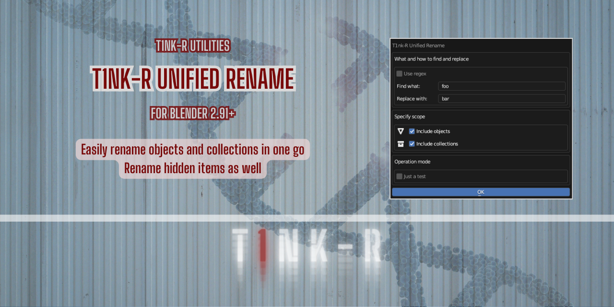
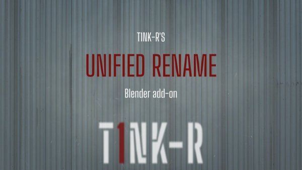
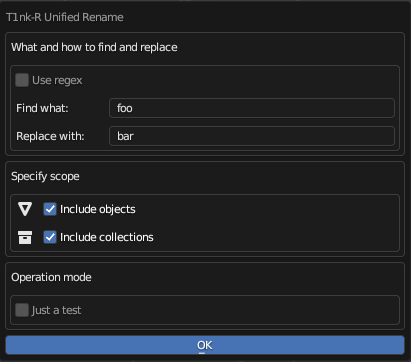

# T1nk-R Unified Rename add-on for Blender

Part of **T1nk-R Utilities for Blender**

Version: Please see the `version` tag under `bl_info` in `__init__.py`.

## TL;DR

You can use this add-on to rename collections and objects in one go, using either plain text or regular expression terms.

You need Blender 2.91 or newer for this add-on to work.

[View tutorial in T1nk-R's YouTube channel](https://www.youtube.com/watch?v=yqaig4bq4o8)

Help, support, updates and anything else: [https://github.com/gusztavj/T1nkR-Blender-Unified-Rename](https://github.com/gusztavj/T1nkR-Blender-Unified-Rename)

## Legal Stuff

### Copyright

This add-on has been created by [T1nk-R (https://github.com/gusztavj/)](https://github.com/gusztavj/).

#### MIT License

Copyright (c) 2023-2024, T1nk-R (Gusztáv Jánvári)

Permission is hereby granted, free of charge, to any person obtaining a copy of this software and associated documentation files (the "Software"), to deal in the Software without restriction, including without limitation the rights to use, copy, modify, merge, publish, distribute, sublicense, and/or sell copies of the Software, and to permit persons to whom the Software is furnished to do so, subject to the following conditions:

The above copyright notice and this permission notice shall be included in all copies or substantial portions of the Software.

THE SOFTWARE IS PROVIDED "AS IS", WITHOUT WARRANTY OF ANY KIND, EXPRESS OR IMPLIED, INCLUDING BUT NOT LIMITED TO THE WARRANTIES OF MERCHANTABILITY, FITNESS FOR A PARTICULAR PURPOSE AND NONINFRINGEMENT. IN NO EVENT SHALL THE AUTHORS OR COPYRIGHT HOLDERS BE LIABLE FOR ANY CLAIM, DAMAGES OR OTHER LIABILITY, WHETHER IN AN ACTION OF CONTRACT, TORT OR OTHERWISE, ARISING FROM, OUT OF OR IN CONNECTION WITH THE SOFTWARE OR THE USE OR OTHER DEALINGS IN THE SOFTWARE.

#### Commercial Use

I would highly appreciate to get notified via [janvari.gusztav@imprestige.biz](mailto:janvari.gusztav@imprestige.biz) about any such usage. I would be happy to learn this work is of your interest, and to discuss options for commercial support and other services you may need.

### Disclaimer

This add-on is provided as-is. Use at your own risk. No warranties, no guarantee, no liability, no matter what happens. Still I tried to make sure no weird things happen:

* This add-on is intended to change the name of your Blender objects and collections matching the criteria you specify.
* This add-on is not intended to modify your objects and other Blender assets in any other way.
* You shall be able to simply undo consequences made by this add-on.

You may learn more about legal matters on page [https://github.com/gusztavj/T1nkR-Blender-Unified-Rename](https://github.com/gusztavj/T1nkR-Blender-Unified-Rename).

## Using the add-on

You can use this add-on when you are in the **Outliner**, meaning that your mouse cursor is floating over an **Outliner** window. To invoke the dialog, either:

* Hit the shortcut, **CTRL+SHIFT+F2** by default.
* Right-click on some empty space in the **Outliner** and find **T1nk-R Unified Rename** near the end of the menu.
* Right-click on an object in the **Outliner** and find **T1nk-R Unified Rename** near the end of the menu.
* Right-click on a collection in the **Outliner** and find **T1nk-R Unified Rename** near the end of the menu.

The dialog features a couple of settings:
||
|:--:|
|_The **T1nk-R Unified Rename** dialog_|

### What and how to find and replace

* **Use regex**
  * Check if you want to specify a regular expression in the **Find what** and **Replace with** fields.
  * Leave empty if you want to search plain text and replace it with plain text.

* **Find what**. Enter the search term. If **Use regex** is checked, this will be considered a regular expression, otherwise plain text.

* **Replace with**. Enter the replacement term. If **Use regex** is checked, this will be considered a regular expression, otherwise plain text.

### Specify scope

* **Include objects**. Check if you want to extend the operation to objects. If checked, objects matching your search term will be renamed. If unchecked, objects won't be renamed.

* **Include collections**. Check if you want to extend the operation to collections. If checked, collections matching your search term will be renamed. If unchecked, collections won't be renamed.

### Operation mode

Check **Just a test** if you want to see the effects of your settings before making actual changes. If this checkbox is checked when you hit **Go**, no objects or collections will be renamed, but you can consult the **System Console** to learn what would be renamed after unchecking this option.

If you like the results, just uncheck **Just a test** and click **Go**. If you made a mistake, stay in this mode and try to fix your search and replacement terms.
